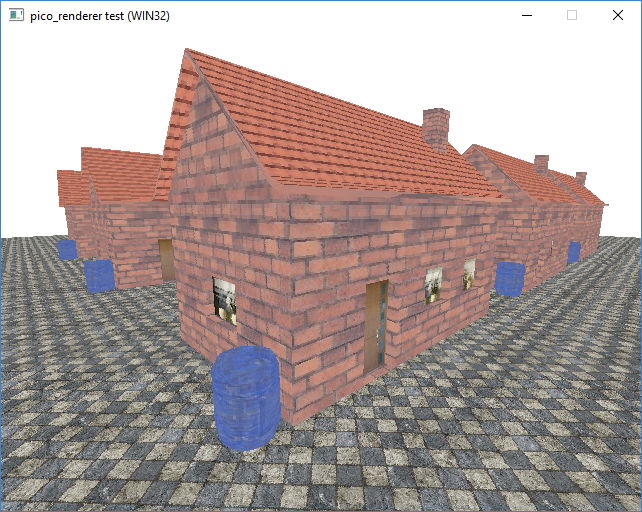

PicoRenderer
============

This project provides a simple, 8-bit colored, 3D software renderer written in C99.
It has an interface similiar to OpenGL 1.1.


Overview
--------

- **Version**: 1.00 Alpha
- **License**: [3-Clause BSD License](https://github.com/LukasBanana/PicoRenderer/blob/master/LICENSE.txt)


Screenshots
-----------

<p align="center"></p>
<p align="center">Example scene (<i>test1</i> on Windows 10)</p>


Supported Platforms
-------------------

- Windows (tested on Windows 10)
- MacOS (tested on OSX El Capitan)
- Linux (demo not available)


Why C and not C++?
------------------

C code is slim, highly portable, compiles fast and for a low-level software renderer one doesn't need lots of object-oriented or templated code.


Build
-----

- CMake 2.8 (http://www.cmake.org/)
- C99 compliant compiler


Fine Tuning
-----------

There are several macros which allows you to enabled or disable specific features for fine tuning.
For example if "PR_FAST_MATH" is defined, all uses of the sine function ('sinf' from the C standard library) will be replaced by "_aprx_sin" which implements an approximated and fast sine function (in src/rasterizer/ext_math.c).
See src/rasterizer/static_config.h for all these macros.


Plugins
-------

This project makes use of the "stb_image" library (see https://github.com/nothings/stb)


Getting Started
---------------

```c
// PicoRenderer (PR) interface example
// (interface still in development)
#include <pico/pico.h>

int main()
{
  if (!prInit())
    return 1;
  
  // Create OS dependent window, this is your task ;-)
  PRuint scrWidth = 800, scrHeight = 600;
  PRcontextdesc contextDesc;
  
  /*
  #if defined(_WIN32)
  
  HWND wnd = CreateWindow(...);
  contextDesc.window = (void*)(&wnd);
  
  #elif defined(__APPLE__)
  
  NSWindow* wnd = [[NSWindow alloc] ...];
  contextDesc.window = (void*)wnd;
  
  #elif defined(__linux__)
  
  Window wnd = XCreateWindow(...);
  contextDesc.window = (void*)wnd;
  
  #endif
  */
  
  // Create render context
  PRobject context = prCreateContext(&contextDesc, scrWidth, scrHeight);
  //prMakeCurrent(context);
  
  // Create frame buffer
  PRobject frameBuffer = prCreateFrameBuffer(scrWidth, scrHeight);
  prBindFrameBuffer(frameBuffer);
  
  prViewport(0, 0, scrWidth, scrHeight);
  
  // Setup projection matrix
  PRfloat projection[16];
  prBuildPerspectiveProjection(
    projection,                   // output matrix
    (PRfloat)scrWidth/scrHeight,  // aspect ratio
    1.0f,                         // near clipping plane
    100.0f,                       // far clipping plane
    74.0f * PR_DEG2RAD            // field of view (FOV) in radians (74 degrees to radians)
  );
  prProjectionMatrix(projection);
  
  // World transform
  PRfloat worldMatrix[16];
  PRfloat rotation = 0.0f;
  
  // Main loop
  PRboolean isQuit = PR_FALSE;
  
  while (!isQuit)
  { 
    // Update user input ...

    // Setup world matrix
    prLoadIdentity(worldMatrix);
    prTranslate(worldMatrix, 0, 0, 2);
    prRotate(worldMatrix, 0, 0, 1, rotation);
    prWorldMatrix(worldMatrix);
    rotation += 0.01f;
    
    // Clear scene (with black background)
    prClearColor(0, 0, 0);
    prClearFrameBuffer(
      frameBuffer,
      0.0f,
      PR_COLOR_BUFFER_BIT | PR_DEPTH_BUFFER_BIT
    );
    
    // Draw yellow triangle
    prColor(255, 255, 0);
    prBegin(PR_TRIANGLES);
    {
      prVertex2f(0, 1.155f);
      prVertex2f(1, -0.577f);
      prVertex2f(-1, -0.577f);
    }
    prEnd();

    // Show frame buffer on render context
    prPresent(context);
  }
  
  // Release all objects
  prDeleteFrameBuffer(frameBuffer);
  prDeleteContext(context);
  
  prRelease();
  
  return 0;
}
```
